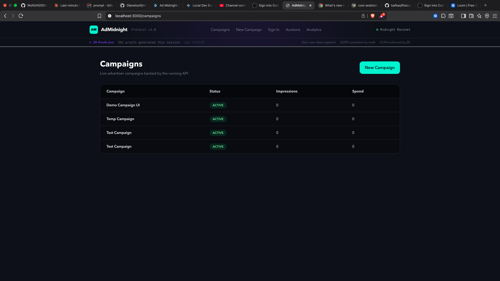
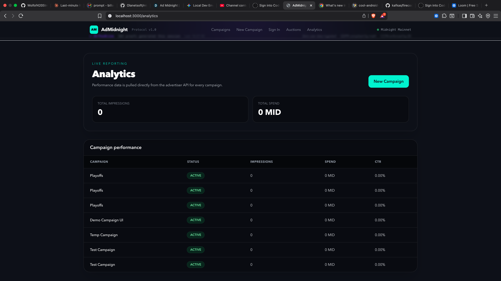
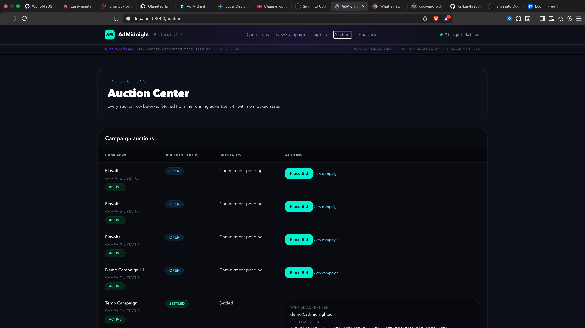
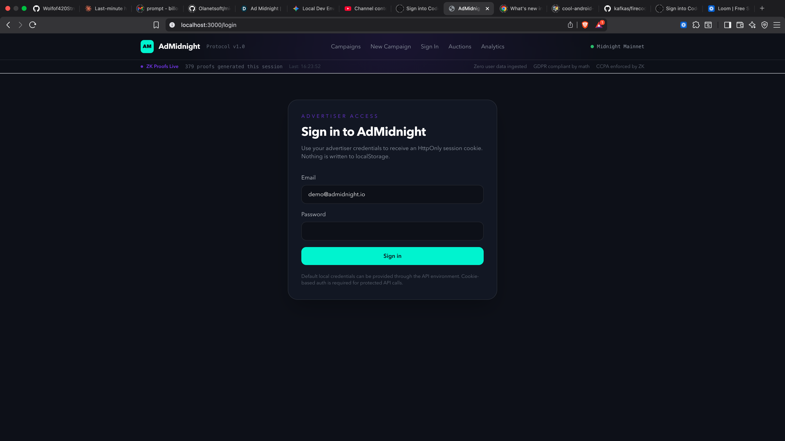

# AdMidnight

AdMidnight is a privacy-preserving advertising platform that uses zero-knowledge proofs and on-chain settlement to enable targeted campaigns without exposing raw user data. Advertisers define segment centroids and run sealed-bid auctions; users generate on-device proofs to demonstrate segment membership and can receive verifiable rewards. Publishers receive transparent, auditable revenue settlements on Midnight Compact contracts.

## How It Works
Users generate zero-knowledge proofs on their device proving membership in a campaign segment; the device submits only the proof envelope and a nullifier to prevent double-claims. The API validates the proof and relays a minimal proof envelope to Compact contracts on the Midnight network. Advertisers commit bids via a sealed-bid flow (commitment hash), then reveal to settle auctions on-chain. Aggregate analytics (impressions, spend, CTR) are recorded by the API and exposed to advertisers without any raw behavioral data.

## Architecture

```
Advertiser Dashboard (Next.js)
        │
        ▼
   NestJS API  ──────────────────────────────────────────┐
        │                                                 │
        ├── Prisma / Postgres                             │
        │                                                 ▼
        └── Midnight Gateway          Compact ZK Contracts
                                      ├── AdMatchRegistry
Flutter Mobile App                    ├── AdAuction
   └── On-device ZK proof engine      └── UserReward
```

## Tech Stack
- API: NestJS + Fastify + Prisma + Postgres
- Dashboard: Next.js 14 (App Router)
- Mobile: Flutter (on-device ZK proof generation)
- Contracts: Midnight Compact (AdMatchRegistry, AdAuction, UserReward)
- Auth: JWT + HttpOnly session cookies

## Getting Started

### Prerequisites
- Node.js 20+
- pnpm 9+
- pnpm@8.6.7
- Docker + Docker Compose
- Flutter 3.x (for mobile only)

### Local Development

```bash
cp .env.example .env
make demo
```

This brings up the database, the API, and the dashboard for local development.

Opens:
- Dashboard: http://localhost:3000
- API: http://localhost:3001
- API docs: http://localhost:3001/docs

Default login: demo@admidnight.io / demo_password_123

### Run E2E Tests

```bash
make e2e
```

## API Reference

Open the local Swagger UI at `/docs` on the running API.

Main route groups:
- `/auth` — session management
- `/advertiser` — campaign creation, bidding, analytics
- `/user` — ZK proof submission, reward claims
- `/publisher` — impression registration, revenue dashboard
- `/internal` — proof validation (role-gated)

## Privacy Model

What stays private:
- Raw embeddings, proof witnesses, and per-user behavioral signals — these are produced and kept on-device.
- Bid values are hidden until reveal in the sealed-bid flow.

What is public or recorded:
- Aggregate outcomes (impression counts, total spend, settlement transaction hashes).
- Segment definitions (centroid metadata) without per-user data.

Why: Midnight programmable data protection combined with nullifier-based claims prevents replay while preserving user privacy.

## Screenshots

### Campaigns


### Analytics


### Auction


### Login


## License

MIT
