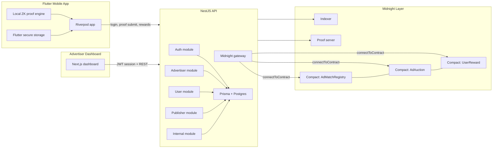
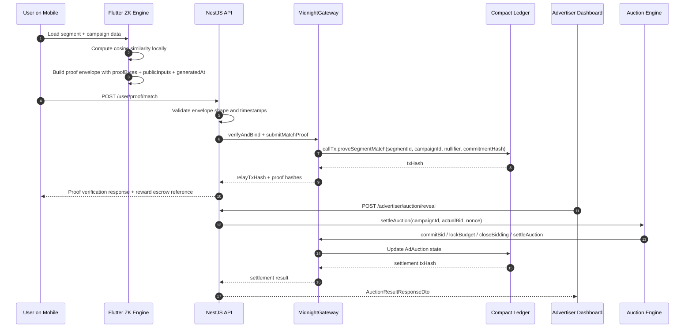

# AdMidnight Architecture

## System Overview

AdMidnight is a privacy-preserving ad-tech platform split across four execution layers:

1. The advertiser dashboard in `apps/advertiser-dashboard` is the operator UI for campaign creation, sealed bidding, and auction review.
2. The backend API in `apps/api` is a NestJS/Fastify service that validates requests, persists protocol state in Prisma, and relays verified actions to Midnight contracts through the SDK wrapper.
3. The mobile app in `apps/mobile` is a Flutter client that computes a local behavioral embedding, generates a match proof on-device, and submits the proof envelope to the backend.
4. The Compact contracts in `packages/zk-circuits/src` are the privacy-preserving ledger layer for match proofs, auction state, and reward escrow.

The backend also depends on the Midnight proof server and indexer for local development and contract connectivity. Contract artifacts are loaded from `packages/zk-circuits/managed` and connected at runtime by the Midnight gateway.

The important boundary is that user-level matching evidence is never sent as raw behavioral data. The mobile app computes the proof envelope locally, the backend verifies envelope integrity, and the Compact ledger only receives the public inputs and commitment hashes required for settlement.

## System Architecture

## Auction Settlement & Zero-Knowledge Proof Submission

## Data Models

### Prisma persistence layer

The API persists protocol metadata in Prisma models under `apps/api/prisma/schema.prisma`:

- `Advertiser`: advertiser identity, role, status, display name, and timestamps.
- `Campaign`: campaign metadata, segment targeting, creative content, budget, bid, lifecycle status, and on-chain transaction hash.
- `Bid`: sealed bid commitment, optional reveal fields, and auction win state.
- `ProofRecord`: proof nullifier, campaign and segment identifiers, proof hashes, match flag, and relay transaction hash.
- `RewardClaim`: reward claim state keyed by nullifier, amount, status, and claim transaction hash.
- `PublisherImpression`: publisher-facing impression record keyed by nullifier with payout metadata.

### Compact on-chain state

The Compact contracts in `packages/zk-circuits/src` hold the protocol state that must remain ledger-enforced:

- `AdMatchRegistry`
  - `campaignImpressions: Map<Bytes<32>, Uint<64>>`
  - `claimedNullifiers: Set<Bytes<32>>`
  - `registeredSegments: Map<Bytes<32>, SegmentConfig>`
  - `totalImpressions: Uint<64>`
- `AdAuction`
  - `auctionState: Map<Bytes<32>, Uint<8>>`
  - `bidCommitments: Map<Bytes<32>, Bytes<32>>`
  - `winners: Map<Bytes<32>, WinnerRecord>`
  - `campaignBudgets: Map<Bytes<32>, Uint<64>>`
  - `protocolBalance: Uint<64>`
- `UserReward`
  - `pendingRewards: Map<Bytes<32>, Uint<64>>`
  - `spentNullifiers: Set<Bytes<32>>`
  - `totalRewarded: Uint<64>`

The key circuit names exposed by the contracts are `proveSegmentMatch`, `registerSegment`, `commitBid`, `lockBudget`, `closeBidding`, `settleAuction`, `escrowReward`, and `claimReward`.

## Privacy Guarantees

AdMidnight uses Midnight-style programmable data protection to keep personal ad-matching data off the public surface:

- The mobile app computes the user embedding and similarity check locally in `apps/mobile/lib/features/matching/domain/zk_proof_engine.dart`.
- The proof envelope contains `proofBytes`, `publicInputs`, and `generatedAt`, but not the raw user embedding.
- The backend verifies that the envelope content matches the request before relaying the proof.
- The Compact ledger stores only the minimum public state required to prevent double claims and settle auctions: nullifiers, commitment hashes, campaign IDs, and aggregate counters.
- Advertiser analytics are aggregated. The API exposes impression counts and spend summaries, not per-user identity data.

What stays private:

- Raw user embeddings
- On-device similarity computation inputs
- Bid values before reveal, when using sealed bid flow
- Reward eligibility proof details beyond the public nullifier and commitment

What becomes public:

- Contract state transitions
- Aggregate campaign and auction outcomes
- Proof relay hashes and settlement hashes
- Reward totals and impression totals

## Runtime Notes

- `apps/api/src/main.ts` enables strict origin-based CORS and security headers.
- `apps/api/src/app.module.ts` configures JWT, throttling, and validation globally.
- `apps/api/src/modules/midnight/midnight.gateway.ts` is the sole relay path from backend services into the Compact contracts.
- `apps/mobile/lib/providers.dart` wires proof generation, reward claims, and auth persistence through Riverpod and secure storage.

## Deployment Topology

In local development, the stack is typically run with the API, dashboard, mobile client, proof server, indexer, and Midnight node available together. The API uses the Midnight artifact bundle in `packages/zk-circuits/managed` and contract addresses supplied through environment variables.

For the hackathon demo, the most important operational path is:

1. Advertiser logs in and creates a campaign.
2. Mobile user generates a proof locally and submits it.
3. Backend validates the proof and records the relay.
4. Advertiser reveals the bid and settles the auction.
5. Reward claim uses the nullifier to prevent double spending.